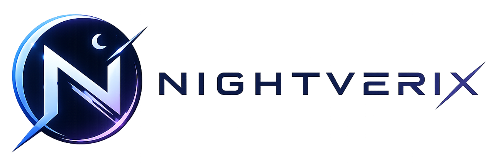

# Nightverix Client
Launcher/Cliente alternativo y open source para Minecraft Java Edition.


> Nightverix Client no es un producto oficial de Minecraft. No está aprobado
> por ni asociado con Mojang o Microsoft.

```
 ⚠️ Source Code Notice

This repository is provided for educational, transparency, and portfolio purposes only.

The source code remains the exclusive intellectual property of Nightverix.

You may view and study the code, but you may **not**:

- Copy substantial parts of the project.
- Redistribute the source code.
- Create forks intended to build competing or derivative launchers.
- Reuse the code in your own software.
- Remove or modify copyright notices.

Any use beyond viewing the code requires prior written permission from the author.

© 2026 Nightverix. All rights reserved.

--SPANISH/ESPAÑOL--

⚠️ Aviso sobre el Código Fuente

Este repositorio se proporciona únicamente con fines educativos, de transparencia y para mostrar el proyecto como parte del portafolio del desarrollador.

El código fuente sigue siendo propiedad intelectual exclusiva de **Nightverix**.

Puedes ver y estudiar el código, pero **no** puedes:

* Copiar partes sustanciales del proyecto.
* Redistribuir el código fuente.
* Crear forks destinados a desarrollar lanzadores competidores o derivados.
* Reutilizar el código en tu propio software.
* Eliminar o modificar los avisos de derechos de autor.

Cualquier uso que vaya más allá de la simple visualización del código requiere la autorización previa y por escrito del autor.

**© 2026 Nightverix. Todos los derechos reservados.**

```
